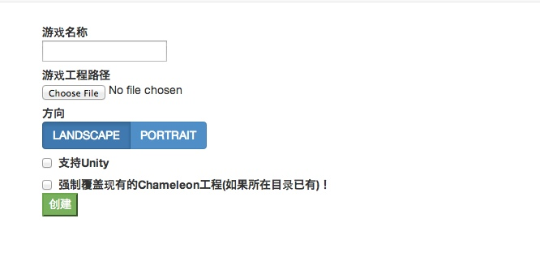
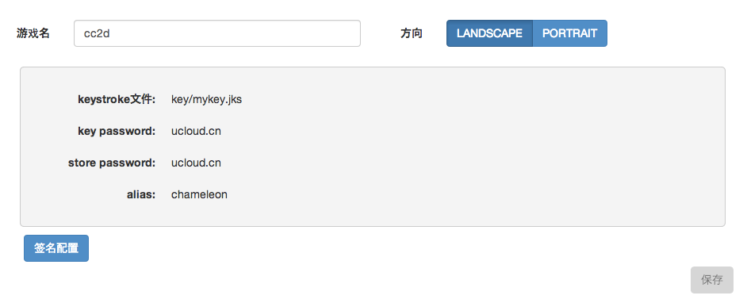
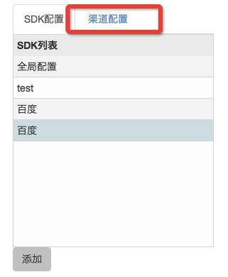
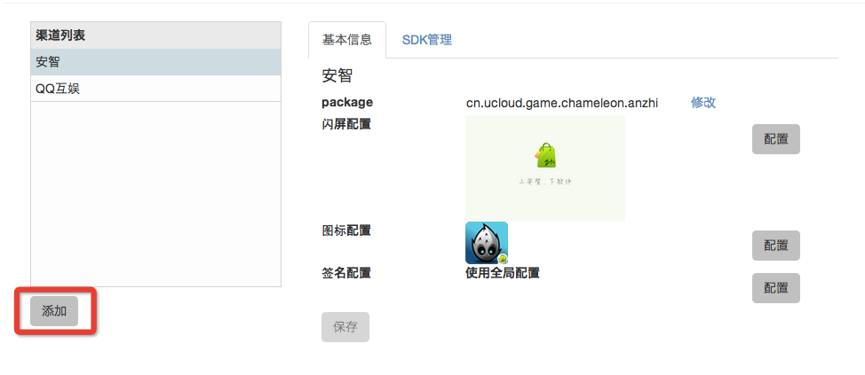

#快速开始

## 建立基本环境
* 请确保您的计算机上装有python2.7.x版本
* 请确保您的计算机上装有android的SDK

## 开始使用工具

chameleon的UI工具使用nodewebkit开发，当您拿到下载包之后，双击 "**node-webkit**" 运行

### 设置Android SDK路径
当您第一次运行工具时候，会要求您设定当前SDK的路径，点击 “**设置**”选择您的SDK路径，例如
``` /Users/wushauk/bin/adt-bundle-mac-x86_64-20131030/sdk ```

### 新建一个Chameleon工程
这一步会安装chameleon相关的文件到您的游戏Android工程底下。
点击 “**新建Chameleon工程**” 打开创建面板



* 游戏名称是您APP的名称
* 游戏工程路径需要选择您游戏Android的工程目录
* 方向是您游戏的Orientation设置
* 如果是Unity，请勾选支持unity，会增加一些Unity的支持库

#### Cocos2dx
对于Cocos2dx，需要注意是指定工程路径时候需要是proj.android那一级

#### Unity
Unity需要导出Android工程才可。
例如导出为Google Android Project。

### 配置全局信息
Chameleon的信息分为两块，在全局配置底下，会有一些对所有SDK共同的信息，包括 游戏名，方向，签名配置等



### 增加SDK，配置SDK信息
点击表格下方的“**添加**”按钮，可以用来增加SDK。添加一个SDK之后，在配置面板里面填写相关信息之后，点击“**添加/更新**”即可保存SDK信息

### 增加渠道，配置渠道信息
点击"**渠道配置**", 即可打开渠道配置面板，用来添加需要支持的渠道。




点击“**添加**”即可打开渠道面板，用来增加需要支持的渠道。

添加之后，可以在右边的面板上进行渠道信息的配置, 例如下图



一般来说，配置渠道至少需要指定使用的**SDK**，点击SDK右边的配置可以选择使用于这个渠道的SDK配置。

另外一些渠道会有一些闪屏和图标的需求，同样可以点击右边的按钮进行选择配置。

### 对您的工程进行一些手动配置
经过以上操作，Chameleon会在您的工程里面自动生成一些东西，包括: 

* 一个Chameleon目录，包含Chameleon的编译文件，渠道library，渠道配置等信息
* 依赖的jar包会自动安装到您Android工程的libs底下
* 一个chameleon_build.py，chameleon工程的编译脚本

之后还有一些需要您手动修改的地方

1. 修改启动的Application类，如果您有自己实现的Application类，可以让它继承```prj.chameleon.channelapi.ChameleonApplication```，如果您没有定义自己的Application类，可以简单的修改AndroidManifest.xml, 在application的tag底下添加一个attribute ``` android:name="prj.chameleon.channelapi.ChameleonApplication"```
2. 修改build.xml, 在```<loadproperties srcFile="project.properties" />```之上添加一行 ```<import file="./chameleon/chameleon_rules.xml" />```
3. 使用Chameleon接口，请参照具体的文档

### 开始编译
在命令行底下，您可以使用在Android工程底下的 chameleon_build.py进行编译
#### chameleon_build.py
使用chameleon_build.py可以用来编译打包渠道的包，例如

```./chameleon_build.py build debug qihu```

将会编译奇虎渠道的debug版本。

命令的基本格式是 ./chameleon_build.py build debug或者release 渠道代号

其中已经安装的渠道的代号可以用 ```./chameleon_build.py list``` 来查看

####编译结果
编译出来的APK会在 YOUR_ANDROID_PROJECT_DIR/bin/{渠道代号}/build底下，例如
```bin/qihu/build```


