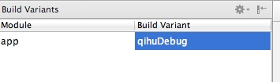

# Hello World
##四步搭建一个支持360平台的环境
* 从Android Studio生成一个新的Android工程，假设这个工程的目录是PROJECT_DIR
* 编写平台的配置文件，使用chameleon.py生成一个奇虎的配置文件, 按照模板进行修改
* 使用chameleon.py创建多平台的开发环境。
``` shell
./chameleon.py generate ./ $PROJECT_DIR/app
```
* 替换build.gradle
```
cd $PROJECT_DIR/app; mv build.gradle.default build.gradle
```

此时在android studio重新同步一下工程，可以看到Build Variant已经多了两个选项，“qihuDebug”, “qihuRelease” 

同时chameleon_sdk.jar也已经被拷贝到$PROJECT_DIR/app/libs底下，并且加入到了app的编译依赖中。接下来就可以在代码里面使用Chameleon SDK提供的各种函数了。

##使用Chameleon SDK
环境搭建好之后，就可以像使用普通的jar包一样使用Chameleon SDK了，例如可以在MainActivity的onCreate添加初始化函数
``` java
PlatformInterface.init(this, true, new IDispatcherCb() {

            @Override
            public void onFinished(int retCode, JSONObject data) {

            }

});
```
调用平台登录
``` java
PlatformInterface.login(this,
    new IDispatcherCb() {
                @Override
                public void onFinished(int i,
                    JSONObject jsonObject) {
                    // callback from chameleon SDK
                }
    },
    new IAccountActionListener() {
                // implementations
    });
```

##编译和打包
* 在Android Studio中直接选择Build Variant，编译某个平台的debug或者release版本
* 命令行下，直接在工程的根目录底下运行
```shell
./gradlew assemble
```
就可以编译和打包所有平台的APK

## Sample
具体例子参见sample/chameleon_java
