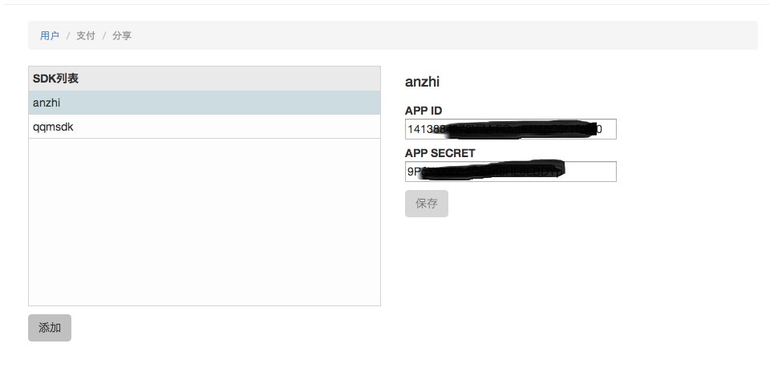
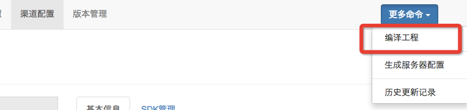

#快速开始

## 建立基本环境
* 请确保您的计算机上装有python2.7.x版本
* 请确保您的计算机上装有android的SDK

## 开始使用工具

chameleon的UI工具使用nodewebkit开发，当您拿到下载包之后，双击 "**node-webkit**" 运行

### 设置Android SDK路径
当您第一次运行工具时候，会要求您设定当前SDK的路径，点击 “**设置**”选择您的SDK路径，例如
``` /Users/wushauk/bin/adt-bundle-mac-x86_64-20131030/sdk ```

### 新建一个Chameleon工程
这一步会安装chameleon相关的文件到您的游戏Android工程底下。
点击 “**新建Chameleon工程**” 打开创建面板


* 游戏名称是您APP的名称
* 游戏工程路径需要选择您游戏Android的工程目录
* 方向是您游戏的Orientation设置
* 如果是Unity，请勾选支持unity，会增加一些Unity的支持库

#### Cocos2dx
对于Cocos2dx，需要注意是指定工程路径时候需要是proj.android那一级

#### Unity
Unity需要导出Android工程才可。
例如导出为Google Android Project。

### 游戏管理
Chameleon的信息分为两块，在游戏管理子页面中，可以对app的全局信息配置包括 游戏名，方向，签名配置等


### SDK配置
配置完全局信息之后，切换到**SDK配置**子页面中，添加和配置需要在APP中使用的SDK，例如



### 渠道配置
添加完所需要的SDK之后，可以在"**渠道配置**"子页面中添加需要支持的渠道，并且应用之前设置的SDK


1. 点击“**添加**”按钮即可打开渠道面板，用来增加需要支持的渠道。
2. 在右边的配置栏中，可以配置这个渠道对应的Package ID，闪屏配置，图标配置，以及需要使用的SDK


### 对您的工程进行一些手动配置
经过以上操作，Chameleon会在您的工程里面自动生成一些东西，包括: 

* 一个Chameleon目录，包含Chameleon的编译文件，渠道library，渠道配置等信息
* 依赖的jar包会自动安装到您Android工程的libs底下


之后还有一些需要您手动修改的地方

1. 修改启动的Application类，如果您有自己实现的Application类，可以让它继承```prj.chameleon.channelapi.ChameleonApplication```，如果您没有定义自己的Application类，可以简单的修改AndroidManifest.xml, 在application的tag底下添加一个attribute ``` android:name="prj.chameleon.channelapi.ChameleonApplication"```
3. 使用Chameleon接口，请参照具体的文档

### 开始编译
配置好以上步骤之后，可以通过客户端中提供的编译功能来编译和打包。

在**渠道管理**子页面的右上角有个**更多命令**的下拉菜单，点击**编译工程**打开编译对话框。




在打开对话框中可以选择对应的渠道，可以进行如下操作

1. 选择对应的渠道开始编译
2. 显示编译详情，可以显示编译的log
3. 打开输出路径，会打开生成的APK所在的路径


