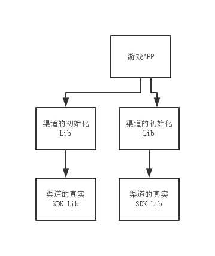

#前台SDK的介绍
Chameleon Client的SDK对现有一些渠道的SDK的API进行了一层抽象，使得游戏只需要使用一套接口就可以适配各个渠道的SDK。

Chameleon SDK使用Android Library方式来管理渠道的SDK的依赖，在编译时候会依据渠道的不同，使用不同的Library工程来编译打包。最终项目的工程组织会像下面这个图所展示的。


 

#公共API设计
##Java的API设计
###回调接口的设计
IDispatcherCb是所有接口的通用回调接口。retCode是操作的错误码，data则是一个json的object，内容在不同接口里面有不同的定义。

```
public interface IDispatcherCb {
	public abstract void onFinished(int retCode, JSONObject data);
}
```
###账号行为监听接口
不少平台都会有由平台组件触发的账号行为，例如切换账号，退出登录等。这部分由于不是有开发者的APP发起的，所以一般需要注册一个回调接口来响应这些事件。
这个接口需要实现四个回调函数，对应不同的账号变化事件。
 
 * preAccountSwitch: 用户即将开始切换账号，此时登录态已然是正常的，一般应用可以在这里保存一些玩家数据
 * afterAccountSwitch: 之前用户已经登出，之后的用户可能登录完成，也可能取消登录了
 * onAccountLogout: 用户已经退出登录
 * onGuestBind: 如果应用支持游客账户登录，那么这个接口可以监听到游客已经完成了注册或者关联了一个现有的账号

```
public interface IAccountActionListener {
    /**
     *  called just before the user switch the account, the uin and session is still valid here
     *  APP can save the user data here
     */
    public void preAccountSwitch();

    /**
     * Previous user has logged out, and maybe has logged in here
     * @param code ERR_OK means the another account has logged in, otherwise the no one 
     *             has logged in APP maybe need to show the login activity again
     * @param newUserInfo if another account has logged in, then the user info is passed 
     *                    here, the structure is same as ChannelInterface.login
     */
    public void afterAccountSwitch(int code, JSONObject newUserInfo);

    /**
     * callback when the user has logged out
     */
    public void onAccountLogout();

    /**
     * if the user logged in as a guest and later an account is bound to this guest, 
     * this callback will be fired with the new account info.
     * @param newUserInfo the bound account info. The structure is same as PlatformInterface.login
     */
    public void onGuestBind(JSONObject newUserInfo);
}
```

###ChannelInterface的静态函数

####初始化（必选）

```
 /**
     * init the SDK
     * @param activity the activity to give the real SDK
     * @param isDebug whether set sdk to debug mode
     * @param cb callback function when the request is finished, the JSON object is null
     */
	public static void init(final Activity activity,
                            boolean isDebug,
			  		        final IDispatcherCb cb)
```
输入的参数

| 参数名 |说明 |
|:---:|:---:|
|activity|就是activity了|
|debug|是否开启debug模式|
|cb|异步操作的回调|


这个函数的回调中得JSON object应该为null

| 参数名 | 类型 | 重要性 | 说明 |
|:---:|:---:|:---:|:---:|
||||

####游客登录(可选)
 ```
    /**
     * login as a guest
     * @param activity the activity to give the real SDK
     * @param loginCallback callback when login guest if finished ,JSON object 
     *					     will have one or three fields
     *                      guest : if this is non-zero, then the user login as a guest,
     *							     following two fields will not exists
     *                      token : the access token from the channel
     *                      others: a segment of json string for SDK server
     * @param accountActionListener listener of the user account actions, 
     * 								 refer to the interface definition
     */
    public static void loginGuest(Activity activity,
                                  IDispatcherCb loginCallback,
                                  IAccountActionListener accountActionListener)
```

输入的参数

| 参数名 |说明 |
|:---:|:---:|
|activity|就是activity了|
|loginCallback|异步操作的回调|
|accountActionListener|这个session的账号活动监听|

这个函数的回调中得JSON类型有

| 参数名 | 类型 | 重要性 | 说明 |
|:---:|:---:|:---:|:---:|
|guest| int| 必须| 0表示不是游客登录，应该走整成的登录流程。1表示是游客登录|
|loginInfo| object| 可选| 如果不是游客登录，那么这个object是登录用户的信息，结构同login接口的返回参数|

#### 登陆（必选）

```
    /**
     * user login to channel
     * @param activity the activity to give the real SDK
     * @param cb JSON object will have two fields
     *           token : the access token from the channel
     *           others: a segment of json string for SDK server
     * @param accountActionListener listener of the user account actions, refer to the interface definition
     */
    public static void login(Activity activity,
                             IDispatcherCb cb,
                             IAccountActionListener accountActionListener)
```
输入的参数

| 参数名 |说明 |
|:---:|:---:|
|activity|就是activity了|
|cb|异步操作的回调|
|accountActionListener|这个session的账号活动监听|

这个函数的回调中得JSON类型有

| 参数名 | 类型 | 重要性 | 说明 |
|:---:|:---:|:---:|:---:|
|token| String| 必须 | 平台给出的会话session的token|
|others| String | 必须 | SDK的透传字段，验证账号时候需要APP的服务器传给SDK服务器|

####提示游客注册
APP可以通过这个接口主动发起游客绑定的流程

```
    /**
     * register guest, if the user is not login as a guest, this function does nothing
     * @param activity  the activity to give the real SDK
     * @param tips the tips for the register, not all channel support customize the tips
     * @param cb callback of the binding request
     *
     * @return boolean, true when user login as a guest 
     *					 and the register can continue, otherwise false
     */
    public static boolean registGuest(Activity activity, String tips, IDispatcherCb cb)
```
输入的参数

| 参数名 |说明 |
|:---:|:---:|
|activity|就是activity了|
|cb|异步操作的回调|
|accountActionListener|这个session的账号活动监听|

返回值

true表示已经开始发起，false表示当前用户不是游客，无法发起这个请求

这个函数的回调中得JSON类型同登录接口


####充值虚拟货币(依据支付类型可选）

```
   /**
     * user charge the currency in the game
     * @param activity
     * @param orderId the order id from server
     * @param uidInGame player id in the game
     * @param userNameInGame  player name in the game
     * @param serverId  current server id
     * @param currencyName the currency name
     * @param payInfo the additional payinfo from chameleon server
     * @param rate the rate of the game currency to RMB, e.g. ￥1.0 can buy 10 game currency, then
     *             rate = 10
     * @param realPayMoney the real money to pay
     * @param allowUserChange can user change the amnout he paid
     * @param cb JSON object will be null
     */
    public static void charge(Activity activity,
                              String orderId,
                              String uidInGame,
                              String userNameInGame,
                              String serverId,
                              String currencyName,
                              String payInfo,
                              int rate,
                              int realPayMoney,
                              boolean allowUserChange,
                              IDispatcherCb cb) 
```

输入的参数

| 参数名 |说明 |
|:---:|:---:|
|activity|就是activity了|
|orderId|购买的订单ID|
|uidInGame|app中的用户ID|
|userNameInGame|app中得用户昵称|
|serverId|server的id|
|payInfo|chameleon server从渠道获取的额外信息|
|currencyName|虚拟货币的名称|
|rate|虚拟货币和RMB之间兑换的汇率，例如￥1.0可以买10个虚拟货币的话,那么这里就填10|	
|realPayMoney|实际支付的RMB,单位: 分|
|allowUserChange|是否允许玩家修改|
|cb|异步操作的回调|


这个函数的回调中得JSON object是NULL

| 参数名 | 类型 | 重要性 | 说明 |
|:---:|:---:|:---:|:---:|
|| |||

####购买道具(依据支付类型可选)


```
    /**
     *  user buy a product
     * @param activity the activity to give the real SDK
     * @param orderId the order id from server
     * @param uidInGame player id in the game
     * @param userNameInGame player name in the game
     * @param serverId  current server id
     * @param productName the name of the product
     * @param productID the id of the product
     * @param payInfo the additional payinfo from chameleon server
     * @param productCount the count of product
     * @param realPayMoney the real money to pay
     * @param cb JSON object will be null
     */
    public static void buy(android.app.Activity activity,
                           String orderId,
                           String uidInGame,
                           String userNameInGame,
                           String serverId,
                           String productName,
                           String productID,
                           String payInfo,
                           int productCount,
                           int realPayMoney,
                           IDispatcherCb cb) 
```
输入的参数

| 参数名 |说明 |
|:---:|:---:|
|activity|就是activity了|
|orderId|购买的订单ID|
|uid|平台的用户id|
|accessToken|平台下发的token|
|appUid|app中的用户ID|
|appUserName|app中得用户昵称|
|serverId|server的id|
|productName|道具的名称|
|productID|道具的ID|
|payInfo|chameleon server从渠道获取的额外信息|
|productCount|道具的数量|
|realPayMoney|真是需要支付的RMB，单位: 分|
|cb|异步操作的回调|


这个函数的回调中得JSON object是NULL

| 参数名 | 类型 | 重要性 | 说明 |
|:---:|:---:|:---:|:---:|
|| |||


#### 登出(必须)

```
  /**
     * user logout
     * @param activity the activity to give the real SDK
     */
    public static void logout(Activity activity)
```
输入的参数

| 参数名 |说明 |
|:---:|:---:|
|activity|就是activity了|
|cb|异步操作的回调|

这个函数的回调中得JSON object是NULL

| 参数名 | 类型 | 重要性 | 说明 |
|:---:|:---:|:---:|:---:|
|| |||

#### 切换账号(可选)

```
   /**
     * for user to switch the account, to many channel it performs logout then login
     * @param activity the activity to give the real SDK
     * @param cb JSON object is the same as the login callback
     */
    public static void switchAccount(Activity activity, IDispatcherCb cb)
```
输入的参数

| 参数名 |说明 |
|:---:|:---:|
|activity|就是activity了|
|cb|异步操作的回调|

这个函数的回调中得JSON情况同__登陆__


####创建浮动按钮(可选)

```
    /**
     * create the float tool bar ( required by 91, UC)
     * @param activity the activity to give the real SDK
     * @param position refer to Constant.Toolbar*
     */
    public static void createToolBar(Activity activity, int position)```

创建浮动按钮，但是不显示这个按钮，需要主动调用显示函数来显示它。

输入的参数

| 参数名 |说明 |
|:---:|:---:|
|activity|就是activity了|
|position|工具条的位置|


####显示或者隐藏浮动按钮(可选)


```
    /**
     *  show or hide the float tool bar (required by 91, UC)
     * @param activity the activity to give the real SDK
     * @param visible true for show, false for hide
     */
    public static void showFloatBar(Activity activity, boolean visible)
```
输入的参数

| 参数名 |说明 |
|:---:|:---:|
|activity|就是activity了|
|visible|是否显示|


####销毁移动按钮(可选)

```
  /**
     *  destroy the tool bar
     * @param activity the activity to give the real SDK
     */
    public static void destroyToolBar(Activity activity)
```
输入的参数

| 参数名 |说明 |
|:---:|:---:|
|activity|就是activity了|


#### 暂停(可选)


```
  /**
     *  when the app is activate from the background( refer to 91 doc, only required by 91)
     * @param activity the activity to give the real SDK
     * @param cb JSON object will be null
     */
    public static void onPause(Activity activity, IDispatcherCb cb)
```

输入的参数

| 参数名 |说明 |
|:---:|:---:|
|activity|就是activity了|
|cb|异步操作的回调|

这个函数的回调中得JSON object是null

| 参数名 | 类型 | 重要性 | 说明 |
|:---:|:---:|:---:|:---:|
|

#### 防沉迷查询(可选)


```
  /**
     *  check if the user is adult, if the channel doesn't provide this interface, user will be
     *  treated as adult
     * @param activity the activity to give the real SDK
     * @param uid channel user id
     * @param accessToken access token
     * @param cb JSON object will receive flag:
     *           ANTI_ADDITION_ADULT
     *           ANTI_ADDITION_CHILD
     *           ANTI_ADDITION_UNKNOWN
     */
    public static void antiAddiction(Activity activity,
                                     String uid,
                                     String accessToken,
                                     IDispatcherCb cb)
```
检查防沉迷信息，如果平台无这种接口，一定会返回成人

输入的参数

| 参数名 |说明 |
|:---:|:---:|
|activity|就是activity了|
|uid|平台的user id|
|accessToken|平台下发的token|
|cb|异步操作的回调|

这个函数的回调中得JSON类型有

| 参数名 | 类型 | 重要性 | 说明 |
|:---:|:---:|:---:|:---:|
|flag| int| 必须 | ANTI_ADDITION_ADULT表示成人，ANTI_ADDITION_CHILD表示小孩，ANTI_ADDITION_UNKNOWN表示没有信息|


####销毁(必须)


```
 /**
     * destroy the sdk instance
     * @param activity
     * @param cb can be null, otherwise it will called when the sdk is desctoryed, JSON will be null
     */
    public static void destroy(Activity activity, IDispatcherCb cb)
```
输入的参数

| 参数名 |说明 |
|:---:|:---:|
|activity|就是activity了|
|cb|异步操作的回调|

这个函数的回调中得JSON object是null

| 参数名 | 类型 | 重要性 | 说明 |
|:---:|:---:|:---:|:---:|


#### 获取玩家在渠道中的UID

```
   /**
     * get channel user id
     * @return channel user id
     */
    public static String getUin()
```

#### 玩家是否已经登陆

```
    /**
     * user have loggined or not
     * @return true if the user have already logged in
     */
    public static boolean isLogined()
```

#### 获取玩家在渠道中的这次登陆的token

```

    /**
     * get the token of this session
     * @return the token of the channel
     */
    public static String getToken() 
```

#### 获取玩家在渠道中的这次登陆的支付所需的token

```
    /**
     * get the pay token of this session
     * @return the pay token of this channel
     */
    public static String getPayToken()
```

#### 响应从Chameleon服务器透传回来的登陆数据

    /**
     * feed the login rsp from the chameleon server to SDK
     * @param rsp the login rsp from chameleon server
     * @return
     */
    public static boolean onLoginRsp(String rsp)


##C++ Bind的设计
###接口定义
C++的接口由三部分组成，第一部分是与Java的API，第二部分是C++的接口部分，最后一部分是事件的回调函数
### Java的初始化API
在prj.chameleon.channelapi.cbinding.NativeChannelInterface中，用来在java中对cbinding中的一些全局信息进行初始化。

```
 /**
     *  init the cbinding channel interface
     * @param activity the main activity
     * @param surfaceView the surfaceview associate the renderer, it can be null. if the 
     *                    surface view is not null, all the callbacks will be post to the
     *                    render thread. Otherwise the callback will be in UI thread
     * @param isDebug whether set the sdk to deubg mode
     */
    public static void init(Activity activity, GLSurfaceView surfaceView, final boolean isDebug);
```
### 平台API

游戏可以通过这一层API调用chameleon的java接口。异步请求的接口都会带有id这个字段，用来当做请求命令的标识，当异步请求完成，调用回调接口时候，也会将这个id传入回调接口。

chameleoncb/ChameleonPlatformAPI.h

```
namespace Chameleon {
namespace ChameleonChannelAPI{
    /**
     * 设置java的虚拟机实例
     */
    void setJavaVM(JavaVM * vm);

    /**
     * 释放设置的java的虚拟机实例
     */
    void releaseJavaVM(JavaVM * vm);

    /**
     * 注册事件的回调实例
     */
    void registCallback(ChannelAPICallbackInf * callbackImp);

    /**
     * 发起游客登录，有些平台不支持游客登录或者平台一些登录策略，也有可能
     * 会发起正式的登录
     * @param {int} id, 标识该请求的id
     * @return {int}, 0表示异步请求成功，否则表示失败
     */
    int loginGuest(int id);

    /**
     * 如果是游客登录, 那么通过这个函数可以发起正式注册的请求
     * @param {int} id, 标识该请求的id
     * @param {std::string} tips, 有些平台可以在注册页面显示一段提供的tips
     * @return {int}, 0表示异步请求成功，否则表示失败
     */
    int registGuest(int id, const std::string & tips);

    /**
     * 发起平台登录请求
     * @param {int} id, 标识该请求的id
     * @return {int}, 0表示异步请求成功，否则表示失败
     */
    int login(int id);

    /**
     * 如果游戏使用了二级货币，那么可以通过这个函数发起充值的请求
     * @param {int} id, 标识该请求的id
     * @param {std::string} orderId, 此次购买的ID
     * @param {std::string} uidInGame, 玩家在游戏中的id
     * @param {std::string} userNameInGame, 玩家在游戏中的名字
     * @param {std::string} serverId, 玩家所在server的ID
     * @param {std::string} currencyName, 二级货币的名称
     * @param {std::string} payInfo, 从chameleon server获得了额外支付信息
     * @param {int} rate, 二级货币的兑换比率，例如，如果1RMB可以兑换10二级货币，那么rate=10
     * @param {int} realPayMoney, 希望玩家支付的数量，如果允许玩家自己输入，那么这个param可能
     *                            会被忽略
     * @param {bool} allowUserChange, 是否允许玩家自己输入
     * @return {int}, 0表示异步请求成功，否则表示失败
     */
    int charge(int id, 
               const std::string & orderId, 
               const std::string & uidInGame, 
               const std::string & userNameInGame, 
               const std::string & serverId, 
               const std::string & currencyName, 
               const std::string & payInfo, 
               int rate,
               int realPayMoney,
               bool allowUserChange);

    /**
     * 如果游戏使用了购买道具的功能，那么可以通过这个函数发起购买的请求
     * @param {int} id, 标识该请求的id
     * @param {std::string} orderId, 此次购买的ID
     * @param {std::string} uidInGame, 玩家在游戏中的id
     * @param {std::string} userNameInGame, 玩家在游戏中的名字
     * @param {std::string} serverId, 玩家所在server的ID
     * @param {std::string} productName, 道具的名称
     * @param {std::string} productId, 产品的ID
     * @param {std::string} payInfo, 从chameleon server获得了额外支付信息
     * @param {int} productCount, 购买的数量
     * @param {int} realPayMoney, 希望玩家支付的数量，如果允许玩家自己输入，那么这个param可能
     *                            会被忽略
     * @return {int}, 0表示异步请求成功，否则表示失败
     */
    int buy(int id,
            const std::string & orderId, 
            const std::string & uidInGame, 
            const std::string & userNameInGame, 
            const std::string & serverId, 
            const std::string & productName, 
            const std::string & productId,
            const std::string & payInfo,
            int productCount,
            int realPayMoney);

    /**
     * 该平台是否支持账号切换
     * @return {bool}, 是否支持账号切换
     */
    bool isSupportSwtichAccount();

    /**
     * 发起切换账户的请求
     * @param {int} id, 标识该请求的id
     * @return {int}, 0表示异步请求成功，否则表示失败
     */
    int switchAccount(int id);

    /**
     * 创建并且显示平台的工具条
     * @param {int} position, 位置参数
     * @return {int}, 0表示异步请求成功，否则表示失败
     */
    int createAndShowToolbar(int position);

    /**
     * 显示或者隐藏工具条
     * @param {bool} isVisible, 显示或者隐藏
     */
    void showToolbar(bool isVisible);

    /**
     * 销毁工具条
     */
    void destroyToolbar();

    /**
     * 调用渠道的onPause事件
     * @param {int} id, 标识该请求的id
     * @return {int}, 0表示异步请求成功，否则表示失败
     */
    int onPause(int id);

    /**
     * 查询防沉迷信息
     * @param {int} id, 标识该请求的id
     * @return {int}, 0表示异步请求成功，否则表示失败
     */
    int antiAddiction(int id);

    /** 
     * 退出渠道SDK
     * @return {int}, 0表示异步请求成功，否则表示失败
     */
    int exit();

    /**
     * 获取渠道的名字
     * @return {string}
     */
    std::string getChannelName();

    /**
     * 获取玩家的id
     * @return {string}
     */
    std::string getUid();

    /**
     * 获取玩家的token
     * @return {string}
     */
    std::string getToken();

    /**
     * 获取玩家的pay token
     * @return {string}
     */
    std::string getPayToken();

    /**
     * 响应从Chamemleon SDK服务器回来的信息
     * @param {string} loginRsp SDK服务器的回包
     * @return {bool} 登陆是否验证登陆成功
     */
    bool onLoginRsp(const std::string & loginRsp);

    /**
     * 是否登录
     */
    bool isLogined();
}
}

```

###平台回调函数
这一部分是一个抽象基类，用于响应平台主动触发的一些事件或者请求的回应

chameleoncb/CPlatformAPICallback.h

```
class ChannelAPICallbackInf {
public:
    virtual ~ChannelAPICallbackInf() {}
    /**
     * 玩家将要进行切换账户，这个函数只会在玩家使用平台的activity时候由平台触发的
     * 回调, 一般在这个时候做一些玩家数据保存工作，当前玩家马上就要登出了
     */
    virtual void preAccountSwitch() {}
    /**
     * 玩家已经完成了账户切换
     * @param {int} code, 表示玩家是否已经登录了新的账户，如果是，那么loginInfo则为有效的数据
     * @param {string} loginInfo, 如果登录了新的账户，那么这个是新账户的登录信息
     */
    virtual void afterAccountSwitch(int code, const std::string * loginInfo) {}
    /**
     * 当前用户从平台退出的回调
     */
    virtual void onAccountLogout() {}
    /**
     * 如果当前玩家是游客登录，并且通过平台的activity注册或者登录了，那么
     * 会通过这个回调告诉游戏正式的玩家登录信息
     * @param {string} loginInfo, 玩家的登录信息
     */
    virtual void onGuestBind(const std::string & loginInfo) {}

    /**
     * 由Chameleon SDK主动发起的登录流程，如果玩家是由游客身份登录，那么就会回调这个函数
     * @param {int} id, 对应请求的ID
     * @param {int} code, 登录成功或者失败
     */
    virtual void onLoginGuest(int id, int code) {}

    /**
     * 由Chameleon SDK主动发起的注册游客的请求的回调
     * @param {int} id, 对应请求的ID
     * @param {int} code, 注册或者登录成功与否
     * @param {string} loginInfo, 玩家的登录信息
     */
    virtual void onRegistGuest(int id, int code, const std::string * loginInfo) {}

    /**
     * 由Chameleon SDK主动发起的登录流程，如果玩家由平台正式用户登录, 则会回调这个函数
     * @param {int} id, 对应请求的ID
     * @param {int} code, 登录成功或者失败
     * @param {string} loginInfo, 玩家的登录信息
     */
    virtual void onLogin(int id, int code, const std::string * loginInfo) {}

    /**
     * 充值二级货币的请求的结果回调
     * @param {int} id, 对应请求的ID
     * @param {int} code, 登录成功或者失败
     */
    virtual void onCharge(int id, int code) {}

    /**
     * 购买道具的请求的结果回调
     * @param {int} id, 对应请求的ID
     * @param {int} code, 登录成功或者失败
     */
    virtual void onBuy(int id, int code) {}

    /**
     * 由Chameleon SDK主动发起的切换账户的请求的结果回调, 无论结果如何，最好当做当前的用户
     * 已经登出了
     * @param {int} id, 对应请求的ID
     * @param {int} code, 登录成功或者失败
     * @param {string} loginInfo, 玩家的登录信息
     */
    virtual void onSwitchAccount(int id, int code, const std::string * loginInfo) {}

    /**
     * 玩家通过点击平台的toolbar可能会切换到平台的activity中去，这个回调用于
     * 通知玩家进入或者退出了平台的activity
     * @param {int} flag, 参见ChameleonErrorCode.h中
     *                    CHAMELEON_SDK_UI_*
     */
    virtual void onToolbar(int flag) {}

    /**
     * 如果调用了PlatformAPI中的onPause函数，那么会进入平台的pause事件处理函数，
     * 当平台的pause事件处理完之后，会回调这个函数
     */
    virtual void onResume() {}

    /**
     * 防沉迷信息请求的结果回调
     * @param {int} id, 对应请求的ID
     * @param {int} code, 登录成功或者失败
     * @param {int} flag, 参见ChameleonErrorCode.h中
     *                    CHAMELEON_ANTIADDICTION_*
     */
    virtual void onAntiAddiction(int id, int code, int flag) {}

    /**
     * 调用销毁SDK实例的结果回调
     * @param {int} id, 对应请求的ID
     */
    virtual void onExit() {}

    virtual void onRunProtocol(int id, int code, const std::string & protocol, 
      const std::string & message) {}
};
```

#如何使用
## Chameleon.py
chameleon.py这个工具用来管理渠道的设置以及工程的安装和升级
由以下几个命令组成
### listch
展示现在Chameleon支持的所有渠道sdk
用法：

``` ./chameleon.py listch ``` 

```
shaukwu-nb:build wushauk$ ./chameleon.py listch
qihu
nd91
```

### showcfg
查看某个渠道SDK的配置说明。

用法:	

``` ./chameleon.py showcfg $CHANNEL_NAME ```

```
shaukwu-nb:build wushauk$ ./chameleon.py showcfg qihu
{
    "appKey": "{string} appKey, YOUR_APP_KEY "
    "uri": "{url} uri, the payment callback uri "
    "appSecret": "{string} appSecret, YOUR_APP_SECRET "
    "isBGTransparent": "{boolean} isBGTransparent, whether the background is transparent , optional, default is true"
    "appId": "{string} appId, YOUR_APP_ID "
    "channel": "{string} channel, 用于标识应用方的子渠道 , optional, default is default"
}
```

### setprop
设置Chameleon工具所需要的环境配置，现在只需要设置android的SDK的根目录
用法:

``` ./chameleon.py setprop $KEY $VALUE ```

```
shaukwu-nb:build wushauk$ ./chameleon.py setprop sdk_root /Users/wushauk/bin/adt-bundle-mac-x86_64-20131030/sdk/
```

### makeprj
为您的某个工程创建chameleon的子目录
用法:

```./chameleon.py makeprj $YOUR_APP_DIR $GAME_NAME $GAME_SHORT_NAME ```

```
shaukwu-nb:build wushauk$ ./chameleon.py makeprj /Users/wushauk/unity/test3/JavaPluginSample 我的unity游戏 my-unity-test
Updated project.properties
Updated local.properties
Added file /Users/wushauk/unity/test3/JavaPluginSample/chameleon/chameleon/proguard-project.txt
```

### addch
为创建过chameleon子目录的工程添加渠道

``` ./chameleon.py $GAME_SHORT_NAME $CHANNEL_NAME $CHANNEL_CFG_PATH```

```
shaukwu-nb:build wushauk$ ./chameleon.py addch my-unity-test qihu ../../platform/qihu.json
Updated project.properties
Updated local.properties
Added file /Users/wushauk/unity/test3/JavaPluginSample/chameleon/libs/qihu/proguard-project.txt
Updated project.properties
Updated local.properties
Updated project.properties
Updated local.properties
```

###upchcfg
为现有的渠道更新配置

``` ./chameleon.py upchcfg $GAME_SHORT_NAME $CHANNEL_CFG_PAHT```

``` 
shaukwu-nb:build wushauk$ ./chameleon.py upchcfg my-unity-test qihu ../../platform/qihu.json
```

## 修改Android的工程
1. 在您的project.properties添加一个libray reference, 例如 ```android.library.reference.1=${chameleon.library.path}```
2. 在您的project.properties添加允许manifestmerger，``` manifestmerger.enabled=true```
3. 修改您的build.xml，在加载```<loadproperties srcFile="project.properties" />```之前添加一行 ``` <import file="chameleon/chameleon_rules.xml" />```

## 编译
### 设置ANDROID_HOME的环境变量
首先设置环境变量，设置ANDROID_HOME，指向您的Android SDK的根目录
当工程安装完成之后，可以使用chameleon_build.py来查看已经安装的渠道以及编译各种渠道

### chameleon_build.py
#### list
显示这个工程已经安装的所有渠道
例如 
```
shaukwu-nb:JavaPluginSample wushauk$ ./chameleon_build.py list
Installed channels:
qihu
```

#### build
编译工程，``` ./chmeleon_build.py build $BUILD_TYPE $CHANNEL_NAME ```
例如

```
./chameleon_build.py build debug qihu
```

#### clean
清理工程 ```./chameleon_build.py clean $CHANNEL_NAME```

#### install
安装apk ```./chameleon_build.py install $BUILD_TYPE $CHANNEL_NAME ```

### apk的路径
最终生成的apk会在您的工程目录的bin底下，bin/$CHANNEL_NAME

例如qihu的渠道，最终会生成在bin/qihu


## Unity的SDK
### 开始使用SDK
* 使用Unity导出android工程到硬盘上（如果使用pro版可以直接导出android工程，或者在Build选项里选择导出google play的工程)
* 使用chameleon.py安装chameleon的文件到你导出的工程里，例如 ```/chameleon.py makeprj -u 导出的工程目录 游戏的名称 游戏的代号```
* 如果使用的导出google play的工程，可以从```chameleon/Resource/unity```目录下拷贝出build.xml和project.properties.chameleon到工程目录底下
* 如果使用pro版导出，那么参考 **“修改Android的工程“**的说明进行设置
* 修改```src/com/unity3d/JavaPlugin/UnityPlayerNativeActivity.java```, 添加两行代码，一行用来import package ```import prj.chameleon.channelapi.unity.UnityChannelInterface;```。另外在onCreate最后添加一行 ```UnityChannelInterface.init(this);```
* 使用chameleon.py添加对应的渠道，```./chameleon.py addch 游戏的代号 渠道名 渠道的配置文件```
* 最后，可以使用您工程目录底下的chameleon_build.py来编译渠道的包，例如 ```./chameleon_build.py build release qihu```

### C#的接口
#### ChameleonSDK的接口
```
		/**
		 * 用户登录
		 */ 
		public static void login() 
		
		/**
		 * 游客登录
		 */ 
		public static void loginGuest() 
		
		/**
		 * 让游客注册成为渠道正式用户或者绑定一个现有的账户
		 */ 
		public static void registGuest(string tip) 
		
		/**
		 * 充值接口
		 * @param orderId 账单ID
     	 * @param uid 用户的渠道ID
     	 * @param accessToken 渠道下发的session
     	 * @param uidInGame 用户在游戏内的ID
     	 * @param userNameInGame  用户在游戏内的昵称
     	 * @param serverId  当前的大区ID
     	 * @param currencyName 货币名称
     	 * @param rate 1元RMB可以购买多少游戏货币
     	 * @param realPayMoney 实际需要支付的钱，单位： 分
     	 * @param allowUserChange 是否允许用户自己输入充值的数量，如果允许，realPayMoney会被忽略
		 */ 
		public static void charge(string orderId, 
		                          string uid, 
		                          string accessToken,
		                          string uidInGame,
		                          string userNameInGame,
		                          string serverId,
		                          string currencyName,
		                          int rate,
		                          int realPayMoney,
		                          bool allowUserChange)
		                          
		/**
     	 *  用户购买一个产品
     	 * @param orderId 账单ID
     	 * @param uid 渠道的User id
     	 * @param accessToken 渠道下发的session
     	 * @param uidInGame 用户在游戏内的ID
     	 * @param userNameInGame 用户在游戏内的昵称
     	 * @param serverId  当前的大区ID
     	 * @param productName 商品名称
     	 * @param productID 商品ID
     	 * @param productCount 商品个数
     	 * @param realPayMoney 实际需要支付的RMB，单位：分
     	*/
		public static void buy(string orderId, 
		                       string uid, 
		                       string accessToken,
		                       string uidInGame,
		                       string userNameInGame,
		                       string serverId,
		                       string productName,
		                       string productId,
		                       int productCount,
		                       int realPayMoney)
		                       
		/**
		 * 用户登出
		 */
		public static void logout()
		
		/**
		 * 当前平台是否支持账户切换
		 */ 
		public static bool isSupportSwitchAccount() 

		/**
		 * 切换账户
		 */ 
		public static void switchAccount() {
			mBridge.callFunc ("switchAccount");
		}

		/**
		 * 创建并且显示工具条
		 * @param position, 创建的位置
		 */ 
		public static void createAndShowToolBar(ToolbarPosition position) {
			mBridge.callFunc ("createAndShowToolBar", (int)position);
		}

		/**
		 * 显示或者隐藏工具条
		 * @param visible， 是否显示
		 */ 
		public static void showFloatBar(bool visible) {
			mBridge.callFunc ("showFloatBar", (int)position, visible);
		}
		
		/**
		 * 销毁工具条
		 */ 
		public static void destroyToolBar() {
			mBridge.callFunc ("destroyToolBar");
		}

		/**
		 * 游戏被切换到后台然后又切回前台之后需要调用这个
		 */ 
		public static void onResume() {
			mBridge.callFunc ("onPause"); 
		}

		/**
		 * 获取防沉迷资料
		 * @param uid, 渠道用户id
		 * @param accessToken, 渠道下发的当前session
		 */ 
		public static void antiAddiction(string uid,
		                                 string accessToken) {
			mBridge.callFunc ("antiAddiction", uid, accessToken);
		}

		/**
		 * 销毁SDK
		 */ 
		public static void destroy() 
		
		/**
		 * 获取渠道的名称
		 */ 
		public static string getChannelName()

		/**
		 * 注册渠道SDK的事件监听
		 */
		public static void registerListener(ChameleonSDK.EventListener listener) {
			mBridge.registerListener (listener);
		}

		/**
		 * 取消注册的事件监听者
		 */ 
		public static void unregisterListener() {
			mBridge.unregisterListener ();
		}
```

#### 事件监听的基类
```
		public class EventListener {
			/**
			 *  SDK初始化完成
			 */
			public virtual void onInit() {}
			
			/**
			 *  用户完成登陆
			 *  @param loginInfo, 登陆信息，可以直接发给SDK server进行验证
			 */ 
			public virtual void onLogin(string loginInfo) {}
			
			/**
			 *  用户通过游客身份登陆了
			 */ 
			public virtual void onLoginGuest () {}
			
			/**
			 * 用户登陆失败 
			 * @param code, 失败的原因
			 */
			public virtual void onLoginFail(int code) {}
			
			/**
			 * 游客用户尝试绑定了一个真实的渠道账户
			 * @param code, 是否绑定成功 
			 * @param loginInfo, 登陆信息，可以直接发给SDK server进行验证
			 */ 
			public virtual void onRegistGuest(int code, string loginInfo) {}
			
			/**
			 * 用户完成支付了
			 * @param code, 支付是否成功的返回值
			 */
			public virtual void onPay(int code) {}
			
			/**
			 * 从渠道的Pause事件返回
			 */ 
			public virtual void onPause() {}
			
			/**
			 * 拉取了用户的防沉迷信息
			 * @param flag, 成人或者未成年，如果渠道没有这个接口，那么都会返回成年
			 */ 
			public virtual void onAntiAddiction(int flag) {}
			
			/**
			 * 渠道SDK已经销毁了
			 */
			public virtual void onDestroyed() {}
			
			/**
			 * 用户切换账户
			 * @param code, 是否切换成功，如果没有成功，则用户已经登出
			 * @param loginInfo, 登陆信息，可以直接发给SDK server进行验证
			 */ 
			public virtual void onSwitchAccount(int code, string loginInfo) {}
			
			/**
			 * 当用户已经登出了
			 */ 
			public virtual void onLogout(){}
			
			/**
			 * 用户即将要切换账户了，可以在这里做一些保存用户资料的工作
			 */
			public virtual void preAccountSwitch(){}
			/**
			 * 游客用户已经绑定到了一个正式的渠道用户上了
			 * @param loginInfo, 登陆信息，可以直接发给SDK server进行验证
			 */
			public virtual void onGuestBind(string loginInfo){}
		}
```

## Cocos2dx的SDK
###开始使用SDK
* 使用chameleon.py安装chameleon的文件到你导出的工程里的proj.android底下，例如 ```/chameleon.py makeprj 导出的工程目录 游戏的名称 游戏的代号```
* 参考**“修改Android的工程“**的说明修改android的ant工程
* 修改src下的java文件，添加一个import ```import prj.chameleon.channelapi.cbinding.NativeChannelInterface;
```, 然后在onCreateView底下添加 ```NativeChannelInterface.init(this, true, glSurfaceView);```
* 修改jni/hellocpp/main.cpp中添加一行include```#include "chameleoncb/ChameleonChannelAPI.h"```, 然后在JNI_OnLoad底下添加一个```Chameleon::ChameleonChannelAPI::setJavaVM(vm);```
* 修改jni/Android.mk，添加一个static library ```LOCAL_WHOLE_STATIC_LIBRARIES += chameleoncb```, 添加一个```$(call import-add-path, $(LOCAL_PATH)/../chameleon)``` 到 ```include $(BUILD_SHARED_LIBRARY)```之后，然后在最后一行添加 ```$(call import-module,chameleoncb)```
* 使用chameleon.py添加对应的渠道，```./chameleon.py addch 游戏的代号 渠道名 渠道的配置文件```
* 最后，可以使用您工程目录底下的chameleon_build.py来编译渠道的包，例如 ```./chameleon_build.py build release qihu``` (具体的Android的打包编译过程设置参考**"编译"**这一选项)

### SDK的API
所有需要回调的请求都会带有一个id的透传字段，用来标识请求，在请求完成回调时候会回传这个字段用来标识那个请求。

```
namespace ChameleonChannelAPI{
    /**
     * 设置java的虚拟机实例
     */
    void setJavaVM(JavaVM * vm);

    /**
     * 释放设置的java的虚拟机实例
     */
    void releaseJavaVM(JavaVM * vm);

    /**
     * 注册事件的回调实例
     */
    void registCallback(ChannelAPICallbackInf * callbackImp);

    /**
     * 发起游客登录，有些平台不支持游客登录或者平台一些登录策略，也有可能
     * 会发起正式的登录
     * @param {int} id, 标识该请求的id
     * @return {int}, 0表示异步请求成功，否则表示失败
     */
    int loginGuest(int id);

    /**
     * 如果是游客登录, 那么通过这个函数可以发起正式注册的请求
     * @param {int} id, 标识该请求的id
     * @param {std::string} tips, 有些平台可以在注册页面显示一段提供的tips
     * @return {int}, 0表示异步请求成功，否则表示失败
     */
    int registGuest(int id, const std::string & tips);

    /**
     * 发起平台登录请求
     * @param {int} id, 标识该请求的id
     * @return {int}, 0表示异步请求成功，否则表示失败
     */
    int login(int id);

    /**
     * 如果游戏使用了二级货币，那么可以通过这个函数发起充值的请求
     * @param {int} id, 标识该请求的id
     * @param {std::string} orderId, 此次购买的ID
     * @param {std::string} uid, 平台的用户ID
     * @param {std::string} accessToken, 此次登录的session
     * @param {std::string} uidInGame, 玩家在游戏中的id
     * @param {std::string} userNameInGame, 玩家在游戏中的名字
     * @param {std::string} serverId, 玩家所在server的ID
     * @param {std::string} currencyName, 二级货币的名称
     * @param {int} rate, 二级货币的兑换比率，例如，如果1RMB可以兑换10二级货币，那么rate=10
     * @param {int} realPayMoney, 希望玩家支付的数量，如果允许玩家自己输入，那么这个param可能
     *                            会被忽略
     * @param {bool} allowUserChange, 是否允许玩家自己输入
     * @return {int}, 0表示异步请求成功，否则表示失败
     */
    int charge(int id, 
               const std::string & orderId, 
               const std::string & uid,
               const std::string & accessToken, 
               const std::string & uidInGame, 
               const std::string & userNameInGame, 
               const std::string & serverId, 
               const std::string & currencyName, 
               int rate,
               int realPayMoney,
               bool allowUserChange);

    /**
     * 如果游戏使用了购买道具的功能，那么可以通过这个函数发起购买的请求
     * @param {int} id, 标识该请求的id
     * @param {std::string} orderId, 此次购买的ID
     * @param {std::string} uid, 平台的用户ID
     * @param {std::string} accessToken, 此次登录的session
     * @param {std::string} uidInGame, 玩家在游戏中的id
     * @param {std::string} userNameInGame, 玩家在游戏中的名字
     * @param {std::string} serverId, 玩家所在server的ID
     * @param {std::string} productName, 道具的名称
     * @param {std::string} productId, 产品的ID
     * @param {int} productCount, 购买的数量
     * @param {int} realPayMoney, 希望玩家支付的数量，如果允许玩家自己输入，那么这个param可能
     *                            会被忽略
     * @return {int}, 0表示异步请求成功，否则表示失败
     */
    int buy(int id,
            const std::string & orderId, 
            const std::string & uid,
            const std::string & accessToken, 
            const std::string & uidInGame, 
            const std::string & userNameInGame, 
            const std::string & serverId, 
            const std::string & productName, 
            const std::string & productId,
            int productCount,
            int realPayMoney);

    /**
     * 该平台是否支持账号切换
     * @return {bool}, 是否支持账号切换
     */
    bool isSupportSwtichAccount();

    /**
     * 发起切换账户的请求
     * @param {int} id, 标识该请求的id
     * @return {int}, 0表示异步请求成功，否则表示失败
     */
    int switchAccount(int id);

    /**
     * 创建并且显示平台的工具条
     * @param {int} position, 位置参数
     * @return {int}, 0表示异步请求成功，否则表示失败
     */
    int createAndShowToolbar(int position);

    /**
     * 显示或者隐藏工具条
     * @param {bool} isVisible, 显示或者隐藏
     */
    void showToolbar(bool isVisible);

    /**
     * 销毁工具条
     */
    void destroyToolbar();

    /**
     * 调用渠道的onPause事件
     * @param {int} id, 标识该请求的id
     * @return {int}, 0表示异步请求成功，否则表示失败
     */
    int onPause(int id);

    /**
     * 查询防沉迷信息
     * @param {int} id, 标识该请求的id
     * @param {std::string} uid, 标识该请求的id
     * @param {std::string} accessToken, 当前的session
     * @return {int}, 0表示异步请求成功，否则表示失败
     */
    int antiAddiction(int id, 
                      const std::string & uid, 
                      const std::string & accessToken);
    /** 
     * 销毁SDK的内容
     * @param {int} id, 标识该请求的id
     * @return {int}, 0表示异步请求成功，否则表示失败
     */
    int destroy(int id);

    /**
     * 获取渠道的名字
     * @return {string}
     */
    std::string getChannelName();
}
```

### SDK的回调接口
所有接口都有默认实现，所以只需要实现自己需要的接口即可

```
class ChannelAPICallbackInf {
public:
    virtual ~ChannelAPICallbackInf() {}
    /**
     * 玩家将要进行切换账户，这个函数只会在玩家使用平台的activity时候由平台触发的
     * 回调, 一般在这个时候做一些玩家数据保存工作，当前玩家马上就要登出了
     */
    virtual void preAccountSwitch() {}
    /**
     * 玩家已经完成了账户切换
     * @param {int} code, 表示玩家是否已经登录了新的账户，如果是，那么loginInfo则为有效的数据
     * @param {string} loginInfo, 如果登录了新的账户，那么这个是新账户的登录信息
     */
    virtual void afterAccountSwitch(int code, const std::string * loginInfo) {}
    /**
     * 当前用户从平台退出的回调
     */
    virtual void onAccountLogout() {}
    /**
     * 如果当前玩家是游客登录，并且通过平台的activity注册或者登录了，那么
     * 会通过这个回调告诉游戏正式的玩家登录信息
     * @param {string} loginInfo, 玩家的登录信息
     */
    virtual void onGuestBind(const std::string & loginInfo) {}

    /**
     * 由Chameleon SDK主动发起的登录流程，如果玩家是由游客身份登录，那么就会回调这个函数
     * @param {int} id, 对应请求的ID
     * @param {int} code, 登录成功或者失败
     */
    virtual void onLoginGuest(int id, int code) {}

    /**
     * 由Chameleon SDK主动发起的注册游客的请求的回调
     * @param {int} id, 对应请求的ID
     * @param {int} code, 注册或者登录成功与否
     * @param {string} loginInfo, 玩家的登录信息
     */
    virtual void onRegistGuest(int id, int code, const std::string * loginInfo) {}

    /**
     * 由Chameleon SDK主动发起的登录流程，如果玩家由平台正式用户登录, 则会回调这个函数
     * @param {int} id, 对应请求的ID
     * @param {int} code, 登录成功或者失败
     * @param {string} loginInfo, 玩家的登录信息
     */
    virtual void onLogin(int id, int code, const std::string * loginInfo) {}

    /**
     * 充值二级货币的请求的结果回调
     * @param {int} id, 对应请求的ID
     * @param {int} code, 登录成功或者失败
     */
    virtual void onCharge(int id, int code) {}

    /**
     * 购买道具的请求的结果回调
     * @param {int} id, 对应请求的ID
     * @param {int} code, 登录成功或者失败
     */
    virtual void onBuy(int id, int code) {}

    /**
     * 由Chameleon SDK主动发起的切换账户的请求的结果回调, 无论结果如何，最好当做当前的用户
     * 已经登出了
     * @param {int} id, 对应请求的ID
     * @param {int} code, 登录成功或者失败
     * @param {string} loginInfo, 玩家的登录信息
     */
    virtual void onSwitchAccount(int id, int code, const std::string * loginInfo) {}

    /**
     * 玩家通过点击平台的toolbar可能会切换到平台的activity中去，这个回调用于
     * 通知玩家进入或者退出了平台的activity
     * @param {int} flag, 参见ChameleonErrorCode.h中
     *                    CHAMELEON_SDK_UI_*
     */
    virtual void onToolbar(int flag) {}

    /**
     * 如果调用了PlatformAPI中的onPause函数，那么会进入平台的pause事件处理函数，
     * 当平台的pause事件处理完之后，会回调这个函数
     */
    virtual void onResume() {}

    /**
     * 防沉迷信息请求的结果回调
     * @param {int} id, 对应请求的ID
     * @param {int} code, 登录成功或者失败
     * @param {int} flag, 参见ChameleonErrorCode.h中
     *                    CHAMELEON_ANTIADDICTION_*
     */
    virtual void onAntiAddiction(int id, int code, int flag) {}

    /**
     * 调用销毁SDK实例的结果回调
     * @param {int} id, 对应请求的ID
     */
    virtual void onDestroy(int id) {}

    virtual void onRunProtocol(int id, int code, const std::string & protocol, 
      const std::string & message) {}
};

```


