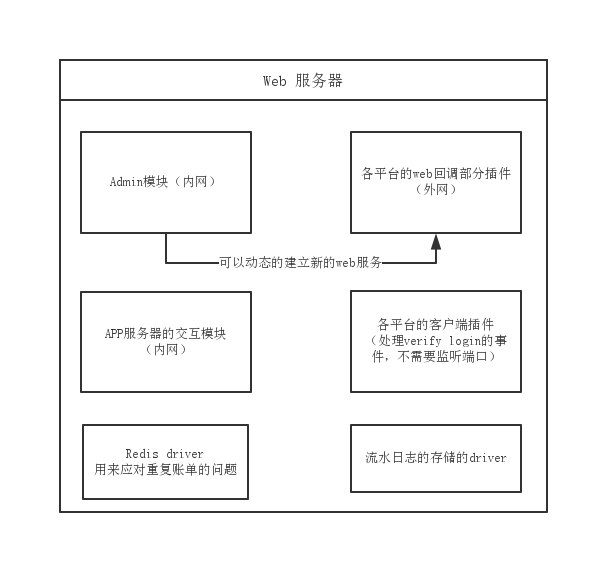
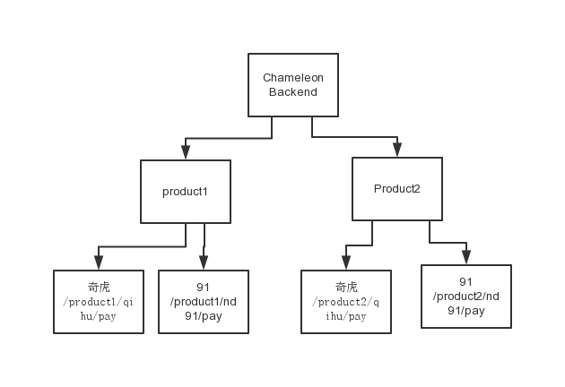
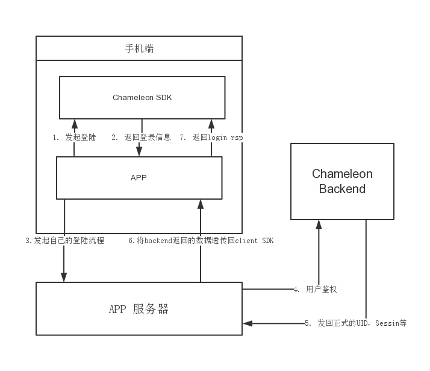
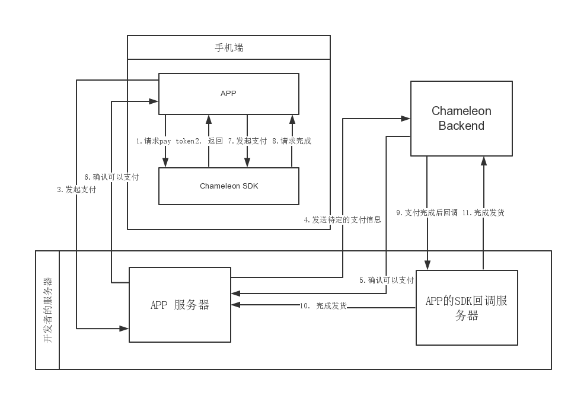

# SDK服务器端设计和接口
##服务器架构设计
主要是web服务器设计，一个web服务器会有一下几个模块



* Admin模块

	Admin模块会开启一个http服务端口，主要功能是查看web服务器的统计状态，以及完成几个管理功能：增减监听平台回调的服务器，配置APP方的回调服务器，设置一些具体的配置等
	
* 平台的web回调插件
	
	主要是监听平台回调的请求，各平台可以通过module方式导入。可以在Admin端配置是否开启监听某个平台的回调web服务。
	
* 同APP服务器的交互模块

	主要是一个web接口，用来响应APP服务器的主动请求

* 各平台的客户端的插件
	
	各平台的客户端插件，主要处理主动发给平台服务器的请求（比如登陆验证）。这个会自动导入，不需要主动去开启。
	
* Redis driver

	为了防止平台多次回调，会把成功处理的账单存储一定时间，这个driver主要是用来查询和存储Redis中的账单信息

* 流水日志存储的driver

	服务器设计上会把登陆和支付等流水信息都入库，这里会有几种driver对应不同的DB，用来存储这些流水日志。
	
## Chameleon SDK的产品管理方式
### Chameleon backend的Server
* SDK server: 响应鉴权请求和发起支付的请求
* Channel callback server： 响应渠道服务器的支付回调
* Admin server： 管理端Server，可以用来查看和修改已经安装的产品和渠道信息

### Chameleon的URL组织方式


Chameleon SDK的后端服务器可以同时服务多个产品，因此Chameleon使用产品方式来组织自己的API URL，例如下图


例如产品名为ucloud，那么

*  SDK Server鉴权的URL 地址是 /ucloud/verify_login
*  SDK Server发起充值请求的地址是 /ucloud/pending_charge
*  SDK Server发起购买道具请求的地址是 /ucloud/pending_buy
*  Channel callback server用来给渠道进行回调的地址是 /ucloud/${渠道代号}/pay
*  Admin模块用来查询产品信息的地址是 /product/ucloud

## Chameleon服务器的配置

###主服务配置

```
{
    "debug" : 0,                   <-- 是否开启log的debug模式
    "sdkSvr" : {					<-- SDK server的配置
        "port" : 8081,
        "host" : "0.0.0.0"
    },

    "admin" : {						<-- Admin server的配置
        "port" : 8083,
        "host" : "0.0.0.0"
    },

    "pendingOrderStoreCfg" : {     <-- 用来存储发起支付账单的存储引擎
        "type": "leveldb",			<-- 必须要有的type字段，将决定kv存储引擎的实现
        "ttl" : 10000              <-- 账单保存的时间
    },
     
    "channelCbSvr" :  {				<-- 渠道回调的HTTP地址配置
        "port" : 80,
        "host" : "0.0.0.0"
    },

    "billCfg" : {						<-- 流水日志的配置
        "name": "bunyanlogger",        <-- 存储的引擎类型
        "cfg": {						<-- 存储引擎的配置
            "path": "./log/bill.log"
        }
    }
}

```

其中 pendingOrderStoreCfg的还支持redis（生产环境下请使用这种），对应的配置是

```
    "pendingOrderStoreCfg" : {
        "type" : "redis",
        "port" : 6379,
        "host" : "192.168.2.110"
    },
```

### 产品的渠道配置
渠道配置可以使用客户端工具生成。客户端工具生成的zip包,放在 products 目录底下解压即可


## 安装和使用

1. 安装nodejs
2. 使用npm安装cnpm ```npm install -g cnpm```
3. 运行./install.py，它会在当前位置解包，并且安装所有插件的依赖
4. 修改config底下的配置svr.json
5. 运行程序 ```nohup node app.js & ```, 或者使用forever等工具来启动node服务器


##用户鉴权流程

用户鉴权流程如下图所示

1. App调用Chameleon的接口发起登陆
2. Chameleon调用渠道SDK获得登陆信息
3. App拿到登陆信息向自己App服务器发起登陆请求
4. App服务器透传字段给Chameleon的后端服务器，进行鉴权
5. 鉴权成功，发回真实的Uid和Token，以及平台的一些附加信息
6. 将Chameleon Backend的信息透传回Chameleon SDK，完成登陆





##支付流程
用户支付的流程如下图所示

1. App想ChameleonSDK请求Pay Token
2. App获得Pay Token
3. App向自己服务器请求支付信息
4. App服务器向Chameleon的后端服务器发起一个待定支付的请求，此时Chameleon Backend服务器会从渠道服务器获取一些必要的信息，分配一个流水号（orderid）, 并且缓存这次交易的一些信息
5. Chameleon的后端确认可以支付
6. App服务器像前端回应可以支付，并透传payInfo字段
7. App向Chameleon SDK发起支付请求
8. Chameleon调用渠道SDK支付完成之后会应给App支付信息
9. 渠道支付成功之后，会通过Chameleon的后端服务器回调App的SDK回调服务器，通知支付信息
10. App的SDK回调服务器通知App服务器发货
11. 发货成功之后App的SDK回调服务器应答之前的请求，通知发货的结果




##服务器通用接口设计

Server这边API设计的主要想法是方便CP去使用，所以信息尽量精简。由于是内网使用，所以也不考虑安全性签名的问题。

	以下假设的SDK的服务器的URL是 api.ucloud.cn

1. 用户登录态验证channel

	接口地址: http://api.ucloud.cn/verify_login
	
	请求方法: POST
	
	支持数据格式: json
	
	请求参数说明：
	
	|参数名称|类型|重要性| 说明|
	|:---:|:---:|:---:|:---:|
	|channel|String|必填|这个请求来源于哪个平台|
	|token|String|必填|由平台方获得的本次session的token|
	|others|String|必填|由前台sdk打包出来的其余登录信息|
	
	成功时返回参数说明：
	
	|参数名称|类型|重要性| 说明|
	|:---:|:---:|:---:|:---:|
	|code|int|必须|返回操作是否成功，参见后边的错误码|
	|loginInfo|Object|可选|如果code为0，则此时loginInfo表示玩家的平台信息，否则为空|
	|loginInfo.uid|String|必须|平台的user id, 最长32字节|
	|loginInfo.token|String|必须|正式的session token，之后请求需要使用这个token，最长64字节|
	|loginInfo.channel|String|必须|平台名字，最长8字节|
	|loginInfo.name|String|可选|用户在平台中的名字，最长32字节|
	|loginInfo.avatar|String|可选|用户在平台中得头像，最长32字节|
	|loginInfo.expire_in|int|可选|如果平台对token时效性有设置，那么这个值返回还有多少秒过期|
	|loginInfo.others|string|可选|平台的其它信息，最长128字节|

2. APP发起购买的道具的请求
    
    接口地址: http://api.ucloud.cn/pending_pay
	
	请求方法:  POST
	
	请求参数说明:
	
	|参数名称|类型|重要性| 说明|
	|:---:|:---:|:---:|:---:|
	|channel|String|必须|平台的名字|
	|uid|String|必须|平台的UID|
	|token|String|必须|平台的pay token|
	|appUid|String|必须|游戏内的UID|
	|serverId|String|必须|发起时候填入的server id|
	|productId|String|可选|道具的ID，如果游戏仅使用充值二级货币功能，那么这个可以忽略|
	|productName|String|可选|道具的名称，如果接入腾讯支付，这个必选|
	|productUrl|String|可选|道具图片的url，如果接入腾讯支付，那么这个必选|
	|productDesc|String|可选|道具的描述，如果接入腾讯支付，那么这个必选|
	|productCount|int|必须|道具的数量|
	|singlePrice|int|必须|道具的单价,单位: 分|
	|realPayMoney|int|必须|实际支付的金额，单位：分|
	|ext|String|必须|用户透传字段|
	
	
	返回参数说明:
	
	|参数名称|类型|重要性| 说明|
	|:---:|:---:|:---:|:---:|
	|code|int|必须|返回操作是否成功，0标示操作成功|
	|orderId|String|必须|SDK服务器生成的orderId，最长48字节|
	|payInfo|String|必须|SDK服务器从渠道获取的一些额外的支付信息，需要应用透传回前端SDK|

4. 购买的回调请求

	接口地址:  由用户自己在SDK服务器上配置
	
	请求方法:  POST
	
	请求参数说明:
	
	|参数名称|类型|重要性| 说明|
	|:---:|:---:|:---:|:---:|
	|channel|String|必须|平台的名字|
	|uid|String|必须|平台的UID|
	|appUid|String|必须|游戏内的UID|
	|serverId|String|必须|发起时候填入的server id|
	|cpOrderId|String|必须|CP这边发起支付时候生成的order id|
	|payStatus|int|必须|支付状态，0标示成功，其它值参照后面的错误码|
	|productId|int|可选|道具的ID，如果是充值二级货币，那么这个值为空|
	|productCount|int|必须|道具的数量|
	|realPayMoney|int|必须|实际支付的金额，单位：分|
	|ext|String|必须|用户透传字段|

	
	返回参数说明:
	
	|参数名称|类型|重要性| 说明|
	|:---:|:---:|:---:|:---:|
	|code|int|必须|返回操作是否成功，0标示操作成功，其它返回值都有可能引起平台方多次回调|
		
	